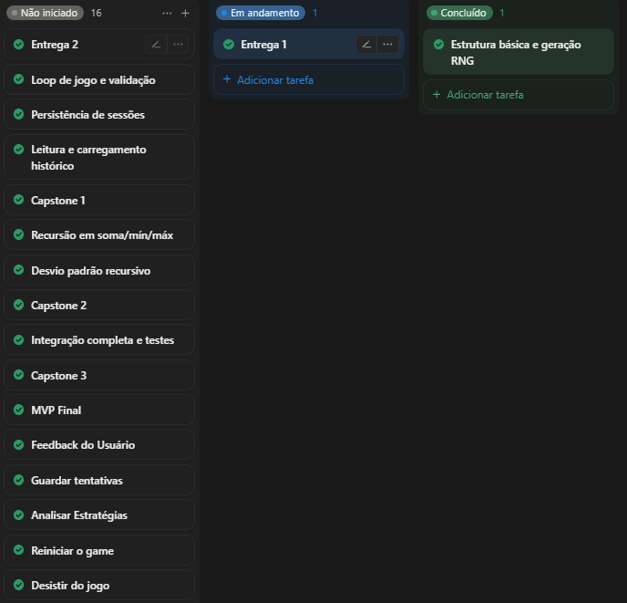

## 👥 Equipe e Papéis

### 🧠 Product Owner
- **[Lucas Henrique](https://github.com/LucasLeoHGM)**  
Responsável pela definição de requisitos, priorização do backlog e validação das entregas.

---

### 📋 Scrum Master
- **[Luis Fim](https://github.com/luisfim)**  
Responsável pela organização do projeto, gerenciamento do quadro e remoção de impedimentos.

---

### 🎨 Designer (UX/UI) & Sound Designer
- **[Mariana Xavier](https://github.com/marixb)**  
Responsável pelo protótipo, fluxo do usuário, experiência visual do sistema e criação/definição de elementos sonoros (feedbacks, acertos, erros, etc.).

---

### 💻 Desenvolvedor Backend (Core)
- **[Victor Barros Roma](https://github.com/RomaNFS21)**  
Responsável pela lógica principal do jogo, incluindo geração de números e interação com o usuário.

---

### 📁 Desenvolvedor de Dados
- **[Ruan Carlos](https://github.com/Ruan-M-Oliveira)**  
Responsável pelo armazenamento e leitura de dados, além da manipulação de arquivos.

---

### 📊 Desenvolvedor de Dados e Estatísticas
- **[Micaella Cabral](https://github.com/micaellabcabral)**  
Responsável pelos cálculos estatísticos e análise de desempenho do jogador.

---

<h2 align="center">📋 Kanban do Projeto</h2>

  

