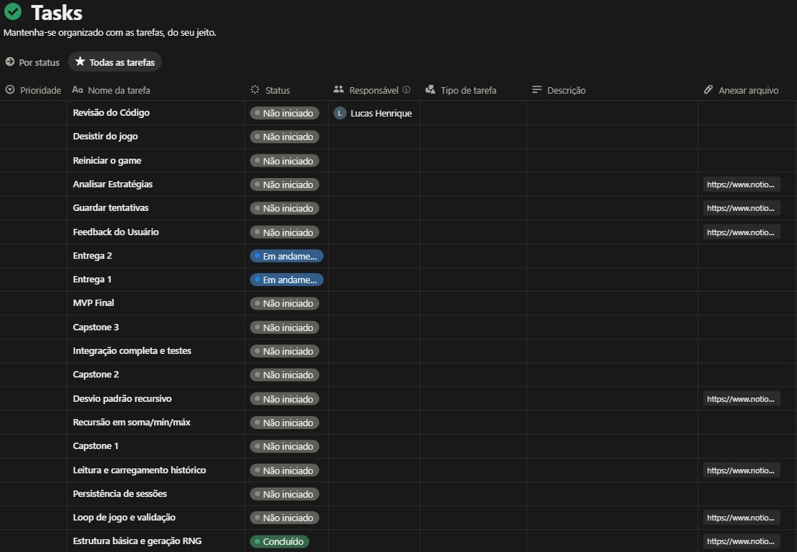
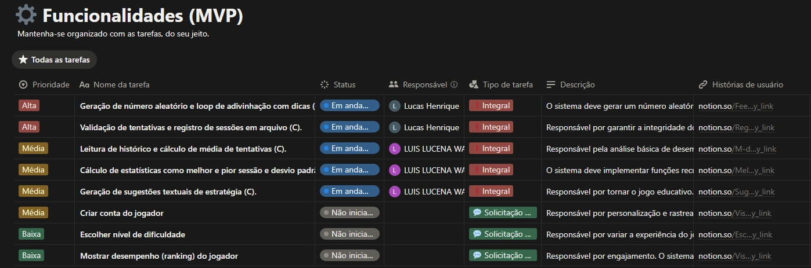
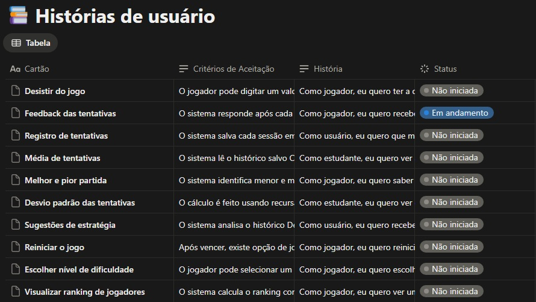
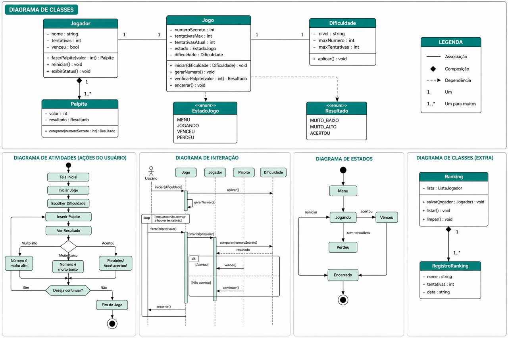

# 🎮 Projeto - C

---

## 📌 Descrição
O projeto consiste em um jogo de adivinhação de números desenvolvido em linguagem C. O objetivo do jogador é descobrir um número aleatório gerado pelo sistema dentro de um intervalo definido, recebendo dicas a cada tentativa que indicam se o valor correto é maior ou menor.

Além do tradicional, este jogo incorpora funcionalidades de análise de desempenho, registrando cada sessão em arquivo e permitindo o cálculo de estatísticas como média de tentativas, melhor e pior desempenho e desvio padrão. Com base nesses dados, o sistema fornece sugestões de estratégia, incentivando o jogador a melhorar sua forma de jogar.

Como diferencial, o jogo incorpora uma identidade inspirada em elementos de RPG. Em vez de simplesmente inserir números manualmente, o jogador interage com um sistema de “rolagem de dados”, onde diferentes valores são apresentados como opções. A cada rodada, o jogador escolhe um dos valores disponíveis tentando acertar o número correto. Ao acertar, o jogador causa dano em um inimigo e avança de fase, criando uma progressão semelhante a combates em jogos de RPG.

Além do aspecto lúdico, o projeto possui um forte caráter educacional, explorando conceitos fundamentais da programação em C, como geração de números aleatórios, manipulação de arquivos, validação de entrada e uso de recursão para cálculos estatísticos. Dessa forma, o jogo funciona tanto como entretenimento quanto como ferramenta de aprendizado prático.

## 🎯 Objetivo
O objetivo do jogador é derrotar inimigos ao longo de diferentes fases, acertando o número secreto gerado pelo sistema. A cada rodada, o jogador escolhe entre valores apresentados (simulando a rolagem de dados) e recebe dicas que indicam se o número correto é maior ou menor, utilizando essas informações para tomar decisões mais estratégicas.

Ao acertar o número, o jogador causa dano ao inimigo e avança no jogo. Durante essa progressão, suas tentativas são registradas, permitindo acompanhar seu desempenho por meio de estatísticas e melhorar sua estratégia ao longo das partidas.

---

## 🧑‍💻 Equipe

### 🧠 Product Owner // Desenvolvedor Backend (Core)
- **[Lucas Henrique](https://github.com/LucasLeoHGM)**  
Responsável pela definição de requisitos, priorização do backlog e validação das entregas.

---

### 📋 Scrum Master
- **[Luis Fim](https://github.com/luisfim)**  
Responsável pela organização do projeto, gerenciamento do quadro e remoção de impedimentos.

---

### 🎨 Designer (UX/UI) & Sound Designer
- **[Mariana Xavier](https://github.com/marixb)**  
Responsável pelo protótipo, fluxo do usuário, experiência visual do sistema e criação/definição de elementos sonoros (feedbacks, acertos, erros, etc.).

---

### 💻 Desenvolvedor Backend
- **[Victor Barros Roma](https://github.com/RomaNFS21)**  
Responsável pela lógica principal do jogo, incluindo geração de números e interação com o usuário.

---

### 📁 Desenvolvedor de Dados
- **[Ruan Carlos](https://github.com/Ruan-M-Oliveira)**  
Responsável pelo armazenamento e leitura de dados, além da manipulação de arquivos.

---

### 📊 Desenvolvedor de Dados e Estatísticas
- **[Micaella Cabral](https://github.com/micaellabcabral)**  
Responsável pelos cálculos estatísticos e análise de desempenho do jogador.

---

## 🧪 Tecnologias
💻 Linguagem principal
C - Utilizada para implementação da lógica do jogo, incluindo geração de números aleatórios, controle de fluxo, manipulação de arquivos e cálculos estatísticos.  
🖥️ Interface Visual
???

---

## 🎨 Design e prototipação
Figma - Utilizado para criação do protótipo da interface do jogo e definição da experiência do usuário.

---

## 🗂️ Versionamento
Git e GitHub - Utilizados para controle de versão, organização do projeto e colaboração em equipe.

---

## 🎥 Documentação e apresentação
OBS Studio - Para gravação do screencast do projeto.

---

## 🧠 Metodologia
Desenvolvimento baseado em Scrum/Kanban (backlog; histórias de usuário ; 3Cs)

---

## ▶️ Como executar
<h2>Como executar o projeto</h2>

<h3>1. Verificar ambiente</h3>

Antes de tudo, verifique se o <strong>GCC</strong> está instalado corretamente:

<pre><code>gcc --version</code></pre>

Se o comando não for reconhecido, instale e configure o <strong>MinGW</strong> e adicione o GCC ao <strong>PATH</strong> do sistema.

<h3>2. Acessar a pasta do projeto</h3>
<pre><code>cd Projeto-C</code></pre>

<h3>3. Compilar o projeto</h3>

Se o arquivo <strong>main.exe</strong> não existir, compile utilizando:

<pre><code>gcc main.c -o main.exe</code></pre>

<h3>4. Executar o projeto</h3>

<strong>PowerShell:</strong>

<pre><code>.\main.exe</code></pre>

<strong>CMD:</strong>

<pre><code>main.exe</code></pre>

<h3>Observação</h3>

Certifique-se de estar dentro da pasta do projeto antes de executar os comandos:

<pre><code>cd Projeto-C</code></pre>

---

## 🎥 Screencast
???(link)

---

## 🔨 Ferramentas tecnológicas
Para o desenvolvimento do projeto utilizamos
- **[Notion](https://www.notion.so/Projeto-em-C-33014fb261ef8017acccc4b1c7c786c5): Utilizado para gestão do projeto**  
- **[Figma](https://www.figma.com/design/pLpnOWmcZg4JNdBwoAstdp/Jogo-Adivinhação?node-id=0-1&t=VEnLR5CqD9WFcHSY-0): Utilizado para prototipação**
  
---

<h2 align="center">📋 Tasks do Projeto</h2>

  

---

<h2 align="center">⚙️ Funcionalidades(MVP)</h2>

  

---

<h2 align="center">📚 Histórias de Usuário</h2>

  

---

<h2 align="center">📊 Diagramas</h2>

  

